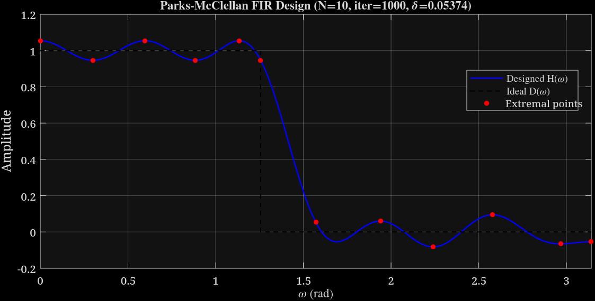

# Parks-McClellan Algorithm — MATLAB Implementation (from scratch)

A hand-written MATLAB implementation of the Parks-McClellan (Remez exchange) algorithm for designing optimal equiripple FIR low-pass filters, based on:

> T.W. Parks and J.H. McClellan, "Chebyshev approximation for nonrecursive digital filters with linear phase," *IEEE Trans. Circuit Theory*, vol. CT-19, no. 2, pp. 189–194, 1972.
>
> J.H. McClellan and T.W. Parks, "A Personal History of the Parks-McClellan Algorithm," *IEEE Signal Processing Magazine*, March 2005.

## Output



*(Upload your plot image to this repo and rename it `output_plot.png`, or edit the path above to match.)*

## Current status: works for small N, breaks down for large N

Documented honestly below rather than glossed over, since the failure mode is itself a faithful echo of what the original authors describe hitting in 1971.

- **Stable and converges correctly** for roughly `N ≤ 18`.
- **Numerically blows up** starting around `N = 20`, and is badly broken by `N = 32`.
- The failure is **not a logic bug in the exchange step** — the matrix stayed reasonably conditioned in spot checks, yet the solved coefficients became unbounded as N increased. This matches the classic symptom of solving a high-order cosine (Vandermonde-like) system directly.
- This is the same numerical wall the original Parks-McClellan paper describes hitting, and the exact reason they built the algorithm around **Barycentric Lagrange interpolation** instead of a direct matrix solve — that part has **not** been implemented here yet.

If you need a working filter at high N right now, use MATLAB's real implementation instead:
```matlab
b = firpm(N, [0 wp/pi ws/pi 1], [1 1 0 0]);
```
This script is a from-first-principles reproduction of the algorithm's logic, not a production replacement for `firpm`.

## What the algorithm does

Design a length-`(N+1)`-tap linear-phase FIR low-pass filter whose amplitude response `H(w)` minimizes the worst-case (Chebyshev/minimax) error against the ideal response:

- **Passband** `[0, wp]`: target = 1
- **Stopband** `[ws, pi]`: target = 0
- **Transition band** `(wp, ws)`: ignored ("don't care" region)

## How this implementation evolved (bugs found and fixed, in order)

### 1. Formulation: solving for delta instead of fixing it
The first working version hard-coded ripple sizes as fixed inputs (`delta1 = 0.005`, `delta2 = 0.005`) and forced an `N+1`-point system to hit those exact values. This isn't how Parks-McClellan actually works — for a given `N`, the achievable minimum ripple is whatever it is; you can't dictate it in advance without risking an infeasible or badly-scaled system.

**Fix:** switched to the standard formulation where `delta` is an **unknown**, solved as part of an `(N+2)×(N+2)` system (extra column of alternating signs `(-1)^i`, extra equation from the added extremal point). `delta1`/`delta2` were removed as fixed inputs where this was applied; `checkCONDITION` was updated to compare against the *solved* `delta`.

### 2. `D - s` instead of `D(w) - s`
`D` is a function handle, not an array — an early version subtracted `s` from the handle itself. Fixed to `e = D(w) - s`.

### 3. `inv(cosMatrix) .* rhs` instead of an actual solve
`.*` is elementwise multiplication, not a linear solve. Fixed to `cosMatrix \ rhs`, later `pinv(cosMatrix) * rhs` once the matrix was properly square.

### 4. Reconstruction loop indexed `omega` instead of the polynomial degree
`s = s + g(i+1) * cos(omega(i+1)*w)` used a frequency value where the harmonic index `i` was needed. Fixed to `cos(i*w)`.

### 5. `checkCONDITION` referenced undefined `a`, `b`
The passband/stopband split indices weren't computed or passed in. Fixed by computing `a = find(w<=wp,1,'last')` and `b = find(w>=ws,1,'first')` inside the function, with `w, wp, ws` passed as arguments (local functions don't see script-workspace variables automatically).

### 6. `findpeaks` only found positive maxima, and its indices were mistaken for frequencies
`[z, omega] = findpeaks(e)` misses negative-going ripples, and its second output is an **index into `e`/`w`**, not a frequency value. Fixed by combining `findpeaks(e)` and `findpeaks(-e)`, then converting indices to frequencies via `omega = w(locs)`.

### 7. Extremal set size drifted from the system size across iterations
`findpeaks` returns however many peaks it finds — not necessarily `N+2` — causing dimension-mismatch errors (`horzcat`, index-out-of-range) on later iterations. Fixed by:
- Forcing the four fixed pivots into the set every iteration: `w = 0, wp, ws, pi`.
- Trimming to exactly `N+2` by keeping the largest-`|e|` points, while protecting the four forced pivots from being trimmed.
- Padding up to `N+2` when too few points were found, retrying with a larger candidate pool since a single-pass fill could still fall short after `unique()` removed collisions.
- Recomputing `np`/`ns` from the actual new `omega` after every exchange rather than assuming they stay fixed.

### 8. Numerical instability at moderate-to-high N — still open
Even with the fixes above, `N` past ~18–20 makes `pinv(cosMatrix) * rhs` return wildly oscillating, unbounded coefficients (visible as spikes far outside `[0,1]` in the plotted response).

**Diagnosis:** `cosMatrix` behaves like a Vandermonde-type matrix in the cosine basis, which is known to become severely ill-conditioned as order grows. Increasing grid resolution (`w` from 50,000 to 200,000 points) and adding a minimum-spacing constraint between candidate extrema (to stop points bunching up near band edges — the exact failure mode the 2005 McClellan/Parks retrospective describes for long filters) pushed the stable range out from failing around N≈32 to around N≈18–20, but did not eliminate the underlying problem.

**Not yet implemented:** Barycentric Lagrange interpolation — the technique the original authors actually used to keep the algorithm numerically robust for long filters (they report successfully designing a 1401-tap filter with it). This would replace the direct `cosMatrix \ rhs` solve with a numerically stable evaluation that avoids building/inverting a high-order matrix at all. Natural next step if higher-N stability is needed.

### Known inconsistency in the last shared version
`checkCONDITION` in the last full script pasted still had the old signature `function [chk] = checkCONDITION(e, w, wp, ws, delta1, delta2)`, while the call site elsewhere passed only `checkCONDITION(e, w, wp, ws, delta)`. This mismatch needs `checkCONDITION` updated to take a single `delta` (comparing `peak1 > abs(delta)` and `peak2 > abs(delta)`) — flagged here rather than silently rewritten, since it was still present as-is in the version most recently shared.

## Reference snippet (last known state, stable up to ~N=18)

```matlab
w = linspace(0, pi, 200000);
delta1 = 0.005;
delta2 = 0.005;
wp = 0.4*pi;
ws = 0.5*pi;
D = @(w)(w<=wp);
N = 10;

np = round((N+2) * wp / (wp + pi - ws));
ns = (N+2) - np;
omega = zeros(1, np+ns);
omega(1:np) = linspace(0, wp, np);
omega(np+1:end) = linspace(ws, pi, ns);
flag = 1;

function [chk] = checkCONDITION(e, w, wp, ws, delta1, delta2)
chk = 0;
a = find(w <= wp, 1, 'last');
b = find(w >= ws, 1, 'first');
peak1 = max(abs(e(1:a)));
peak2 = max(abs(e(b:end)));
if peak1 > delta1 || peak2 > delta2
    chk = 1;
end
end

for j = 1:1000
    signs = (-1).^(1:(N+2));
    cosMatrix = [cos(omega(:) * (0:N)), signs(:)];
    rhs = zeros(N+2,1);
    for i = 1:np
        rhs(i) = 1;
    end
    for i = np+1:N+2
        rhs(i) = 0;
    end
    sol = pinv(cosMatrix) * rhs;
    g = sol(1:N+1);
    delta = sol(N+2);
    s = 0;
    for (i = 0:N)
        s = s + g(i + 1) * cos(i*w);
    end
    e = D(w) - s;
    if checkCONDITION(e, w, wp, ws, delta)
        [~, locsPos] = findpeaks(e);
        [~, locsNeg] = findpeaks(-e);
        locs = [locsPos, locsNeg];
        a = find(w <= wp, 1, 'last');
        b = find(w >= ws, 1, 'first');
        locs = unique([1, a, b, numel(w), locs]);
        minGap = round(numel(w) / (3*(N+2)));
        locs = sort(locs);
        keep = true(size(locs));
        lastKept = locs(1);
        for k = 2:numel(locs)
            if locs(k) - lastKept < minGap
                keep(k) = false;
            else
                lastKept = locs(k);
            end
        end
        locs = locs(keep);
        if numel(locs) > N+2
            forced = [1, a, b, numel(w)];
            rest = setdiff(locs, forced);
            [~, order] = sort(abs(e(rest)), 'descend');
            nRemaining = (N+2) - numel(forced);
            locs = sort([forced, rest(order(1:nRemaining))]);
        end
        if numel(locs) < N+2
            extra = (N+2) - numel(locs);
            fillLocs = round(linspace(1, numel(w), extra));
            locs = unique([locs, fillLocs]);
            locs = locs(1:(N+2));
        end
        omega = w(locs);
        np = sum(omega <= wp);
        ns = numel(omega) - np;
    else
        break
    end
end

figure;
plot(w, s, 'b', 'LineWidth', 1.2);
```

## Parameters

| Variable | Meaning |
|---|---|
| `wp`, `ws` | Passband / stopband edge frequencies (rad) |
| `N` | Polynomial degree (cosine basis order); extremal set size is `N+2` |
| `delta` | Solved equiripple error bound (no longer a fixed input) |
| `omega` | Current extremal frequency set, updated each Remez iteration |
| `minGap` | Minimum index spacing enforced between candidate extrema, to reduce clustering-driven instability |

## References

1. T.W. Parks and J.H. McClellan, "Chebyshev approximation for nonrecursive digital filters with linear phase," *IEEE Trans. Circuit Theory*, vol. CT-19, no. 2, pp. 189–194, 1972.
2. E.M. Hofstetter, A.V. Oppenheim, and J. Siegel, "A new technique for the design of non-recursive digital filters," Proc. 5th Annu. Princeton Conf. Information Sciences and Systems, 1971.
3. O. Herrmann, "Design of nonrecursive digital filters with linear phase," *Electron. Lett.*, vol. 6, no. 11, pp. 328–329, 1970.
4. E. Ya. Remez, "General computational methods of Tchebycheff approximation," Kiev, 1957.
5. J.H. McClellan and T.W. Parks, "A Personal History of the Parks-McClellan Algorithm," *IEEE Signal Processing Magazine*, March 2005
